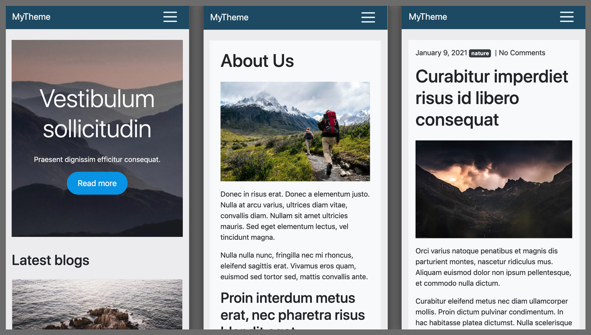

# Wordpress custom theme and cloud deployment

**I made a custom Wordpress theme from scratch and deployed the app to Google Cloud with GitHub Actions.**

The **Wordpress** theme is responsive and uses **Bootstrap** for styling. It has templates for front page, blog, posts and pages. It also has widget placements for footer and promo content on the front page. The theme uses functions and some additional css styling for customization.

Wordpress CMS and the website using my theme have been deployed to **Google Cloud Run** using a **Docker** container and it uses **Google Cloud SQL** for MySql database. Uploaded images are stored in **Google Cloud Storage** bucket using WP Offload Media Lite plugin.

Deployment is automated using **GitHub Actions**. The pipeline builds the docker image, pushes it to Google Cloud Run and deploys the package. The action is triggered when new code is pushed to the repository or a pull request is merged. The action dowloads the latest version of WordPress, specified plugins and includes my own themes and configuration files for WordPress.

I also used Docker Compose for local development. The setup is running Wordpress, phpMyAdmin and mySql containers in a local network. Visual Studio Code was used for development.

## More info
- [Wordpress](https://wordpress.org/)
- [Google Cloud Run](https://www.google.com)
- [Google Cloud SQL](https://cloud.google.com/sql)
- [Docker](https://www.docker.com/)
- [Bootstrap](https://getbootstrap.com/)

